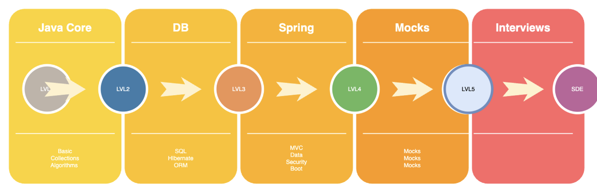

# Course on Java back-end developer from JAVAT
Hi, my name is **Temirlan**. This course is created for those who want to learn programming in **Java**,
but don't know anything about programming yet.

## About me
I am a developer with experience in IT and teaching beginner programmers. Want to learn more about me or get in touch
directly for mentorship or partnership? Visit my [LinkedIn profile](https://www.linkedin.com/in/temirlan100).

## Why Java?
Java is one of the most popular programming languages in the world. It is used in many projects of different
scale - from mobile applications to large corporate systems. Java allows you to develop solutions for various
domains: finance, medicine, games, science and many others. Learning Java will open doors to the fascinating world of IT
and many exciting opportunities

## Course Benefits
- **Mentor support**: after completing the 'Java Core' module, each student will have the opportunity to receive support from a mentor.
- **Collaborative project defence**: you will work on projects and present them for defence with other course participants or on your own.
- **Mock interviews**: mock interviews are conducted to better prepare you for real interviews.
- **Community Developer Meetings**: Meetings are organised with professional developers and other IT professionals to broaden your understanding of the industry and provide networking opportunities.

# RoadMAP of the course

## Course Structure
## **Java Core**
##### [Introduction to Java](JavaCore/lessons/hello_world.MD)
- History and features of the Java language
- Installing the JDK (Java Development Kit)
- Installing IntelliJ IDEA
- "Hello World!" - Your first Java programme

##### Basic language elements
- [Scanning the input](JavaCore/lessons/linput_scanning.MD)
- [Data types and Operators](JavaCore/lessons/data_types_operators.MD)
- [Constants with `final` and code blocks and variable scope](JavaCore/lessons/finak_blocks.MD)

##### Conditional operators
- [`if-else` operator](JavaCore/lessons/if_else.MD)
- [`switch` operator](JavaCore/lessons/switch.MD)

##### Loops
- [Cycle `do-while`](JavaCore/lessons/do_while.MD)
- [Cycle `while`](JavaCore/lessons/while.MD)
- [Loop `for`](JavaCore/lessons/for_loop.MD)

##### Arrays
- [Basics of working with arrays and the foreach loop](JavaCore/lessons/array.MD)
- [Multidimensional Arrays](JavaCore/lessons/matrix.MD)

##### Collections
- [Class `ArrayList`](JavaCore/lessons/list_arraylist.MD)
- [Class `HashSet`](JavaCore/lessons/set_hashset.MD)
- [Class `HashMap`](JavaCore/lessons/map_hashmap.MD)
- [Class `TreeSet`](JavaCore/lessons/treeset.MD)
- [Class `TreeMap`](JavaCore/lessons/treemap.MD)

##### Reading files
- [Basic file operations](JavaCore/lessons/file_io.MD)

##### OOP Basics
- [Introduction to OOP (Objects, Classes)](JavaCore/lessons/intro_oop.MD)
- [Access modifiers](JavaCore/lessons/access_modifiers.MD)
- [Inheritance](JavaCore/lessons/inheritance.MD)
- [Abstract class and Interfaces](JavaCore/lessons/abstract_class_interface.MD)
- [Polymorphism](JavaCore/lessons/polymorphism.MD)
- [Encapsulation](JavaCore/lessons/encapsulation.MD)
- [Static class elements](JavaCore/lessons/static.MD)
- Internal classes
- Lambda expressions
- What is Enum class? How to use it and when to use it

##### Exception Handling
- `try-catch` and `finally` blocks
- Creating your own exceptions

##### Streams
- Basics of Streams in Java
- Working with data streams

##### JavaDoc
- How to create JavaDoc comments
- How to generate documentation

##### Java Core module final projects
- Project #1 **WIP**
- Project #2 **WIP**

## **Java App + DB**
- Application development and database work.
- **WIP**.

## **Spring**
- Basics of working with the popular Spring framework.
- **WIP**.

## Additional Opportunities
In addition to learning the basics of programming, you will have the opportunity to get:
- Test interview support.
- Opportunities to participate in internships for those who successfully complete the course.
- Leading graduates to an JO, on full completion of the course.

## Community
We have a [Telegram group](https://t.me/+p49eOfpbwso2N2My) where you can ask questions, 
discuss course material, and meet other enthusiasts.